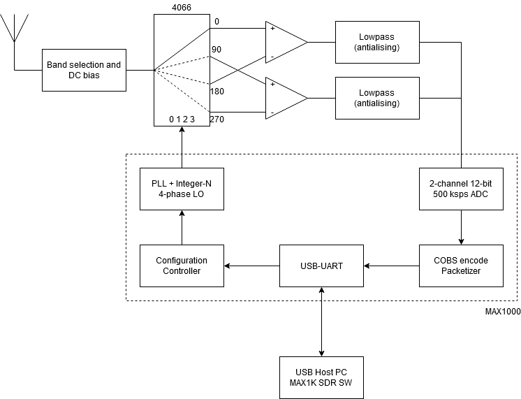

max1k-sdr-rtl
==

FPGA RTL of MAX1k mini-SDR project 
Have a look at the RTL and RF side here: https://github.com/fyazici/max1k-sdr-sw

RF frontend is simply a band-select filter with CD4066 configured as a mixer for 4-phase Tayloe detector at 50 Ohm system impedance. 4-phase LO signal is provided by the FPGA using a PLL and integer divider where the output frequency is configurable over UART. The mixed differential I and Q signals are fed to to LM358 opamps in full differential gain mode and the output has a conservative first order lowpass filter for antialiasing. Embedded 1 Msps ADC of MAX1000 chip samples the I and Q signals and the 12-bit values are encoded using COBS. Packets of samples are sent over the UART and FT2232H handles the USB communication.

RTL side block diagram:

TODO: 
- Analog side circuit schematic
- Video amplifier for baseband signal instead of LM358
- FT2232H FIFO mode instead of UART for full speed USB support (to reach 12-bit per sample @ 1 Msps = 12 Mbps)
